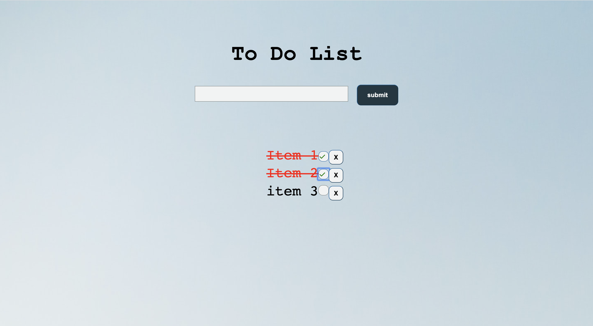

# ToDo-app
# Clock-app
This is my second application where I learned to how to leverage local storage to create a list of item and having the option to eith strike the item or remove it. This application was written entirely in pure Javascript, HTML, and CSS.

click <a href="https://mauroleos.github.io/ToDo-app/">here</a> to see website.

